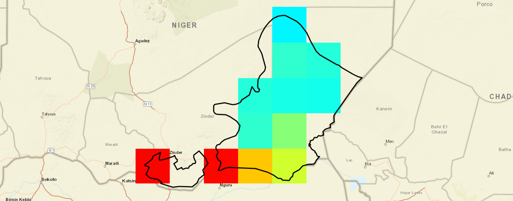
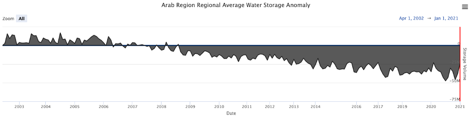

# **Computational Algorithm**

The GRACE Groundwater Subsetting Tool (GSST) Web Application relies on
the Earth Observation data collected by NASA through satellites which
map the gravitational field of the Earth. Changes in gravity are driven
by changes in water storage, offering a rare opportunity to monitor
groundwater level through satellites coupled with estimated surface
water.

The GRACE mission was launched in March 2002. It consists of a pair of
satellites that are 400km above the Earth and are separated by 200km. As
the satellites pass over different regions of the Earth, the front and
rear satellites are pulled slightly forward and backward in response to
subtle changes in the Earth\'s graviatational field caused by changes in
surficial mass. This causes the distance between the satellites to vary,
and the changes are recorded by a k-band microwave whose accuracy is
within 10 microns. The GRACE satellites follow a varying path that
covers the entire Earth about once per month. This data is then
processed by NASA to produce a map of the Earth\'s gravitational field.
Each month a new map is generated and the differences are calculated to
produce a gravity anomaly map. The changes in mass are assumed to be
primarily caused by the change in water storage. Each month NASA
generates a gridded map of total water storage anomaly at 3-degree
resolution. This map is then down-scaled using a mass conservation
algorithm to 0.5-degree resolution and made available for download in
netCDF multidimensional raster format.

## **Derivation of Groundwater Dataset**

The groundwater component of the GRACE raw data can be separated using a
mass balance approach, with NASA's Global Land Data Assimilation System
(GLDAS) models to compute the surface water component of the data. To
compute total surface water storage, we sum the components of the GLDAS
models that represent surface water storage and subtract this total from
the GRACE dataset to estimate a groundwater storage anomaly dataset.

This GSST application uses four sets of data:

-   The GRACE TWSa dataset
-   The GLDAS canopy storage dataset (CAN)
-   The GLDAS snow water equivalent (SWE)
-   The GLDAS soil moisture (SM)

To compute the groundwater storage anomaly (GWa), we use three
components of the GLDAS models: CAN, SWE, and SM. We convert each GLDAS
component to an anomaly format by subtracting the mean centered on
values from 2004 to 2009 and then average across the three GLDAS models
to produce a component anomaly dataset: CANa, SWEa and SMa. We use the
standard deviation from the three GLDAS models to help estimate
uncertainty.

We download GLDAS files, format them as netCDFs and store them locally.
Normally the data is acquired in a gridded format with a 1-degree
latitude by 1-degree longitude resolution, which we then convert to a
0.5-degree resolution. This conversion is performed by an area-weighted
average of the four GRACE grid cells coincident with each GLDAS grid
cell.

The converted files are then used to compute the groundwater anomaly
using a mass balance approach. The groundwater anomaly is the difference
between the TWSa and the sum of the surface water component anomalies.

$$GWa =  TWSa - (SWEa+ CANa+ SMa)$$

The result of this computation is the ground water storage anomaly, a
tested and approved method to predict long-term changes in groundwater
storage.

## **Grid Subsetting**

For regional subsetting, the user provides a shapefile that defines the
boundary of the region of interest. We then select the cells that have
cell centers within the defined boundary and calculate the average
storage anomaly for each of the components: TWSa, SWEa, CANa, and SMa
resulting in a time series from 2002 to the present for each component
on a monthly time step. The figure below shows the Chad Basin in Niger
subsetted and displayed with the region shapefile. For water storage,
the average of each component is multiplied by the area of the region,
resulting in volume anomalies.

{.align-center}

## **Uncertainty Estimates**

It is critical to understand that the results of these predictions have
uncertainties and limitations.

To compute the uncertainty of the groundwater storage component, we
combine the uncertainty estimates from both the GRACE and GLDAS by
computing the square root of the sum of the squares of the uncertainty
of the individual components as measured by their standard deviations.

$$\sigma GWa =  \sqrt {(\sigma TWSa)^2 - (\sigma SWEa)^2 - (\sigma CANa)^2 - (\sigma SMa)^2}$$

The resulting estimates of groundwater data are not suitable for highly
precise or localized applications, such as the placement of wells;
rather, these data serve as an estimate of general trends in groundwater
storage.

## **Storage Depletion Curve**

The GGST offers an option of viewing time series data in the format of a
storage depletion curve, which is the time-integral of the storage
anomaly.

The storage depletion curve presents cumulative changes in water
component storage relative to levels when the GRACE missions began
distributing data in April 2002. The storage depletion curve is used in
groundwater management since it offers a simple visualization of how
much storage aquifers have gained or lost since a given point in time.

To compute the depletion, we sum the GWSa over time to determine changes
in groundwater storage volume over time for the region. These data show
if a region is depleting storage in the region, or if groundwater is
recharging in the region thereby providing valuable information relative
to groundwater sustainability.

Here is an illustration of Northern Africa and the Arabian Peninsula
from 2002 - 2021. It shows that the groundwater in that region has been
depleting since early 2009 and onward.

{.align-center}

## **Limitations**

GRACE data come with limitations that users need to know and understand.
The data are provided at a relatively low resolution (1-degree latitude
by 1-degree longitude) representing a 100 km x 100 km square,
approximately. At such a low resolution, basing decisions on a single
cell comes with high and unknown uncertainties. Raw GRACE data is at an
even coarser resolution (3-degrees latitude by 3-degrees longitude)
which is then processed to higher resolutions TWSa data.

Even with these limitations, GRACE data provide valuable insights into
aquifers such as regions that are depleting and recharging, hence
allowing managers to sustainably use their groundwater resources. The
best use of the GGST is to draw general trends in aquifers rather than
selecting a placement of a well.

It is also recommended that, whenever possible, these data be validated
with local data. GGST displays the uncertainties in the data
calculations as error bands on time series, providing context on regions
and different time periods.

## **Software Availability**

The GGST web application was created using Tethys Platform, developed in
the BYU Hydroinformatics Laboratory. It can be accessed on a Tethys
portal associated with the NOAA GeoGLOWS project by browsing to this
[link](https://apps.geoglows.org/apps) and selecting the Grace
Groundwater Subsetting Tool application.
