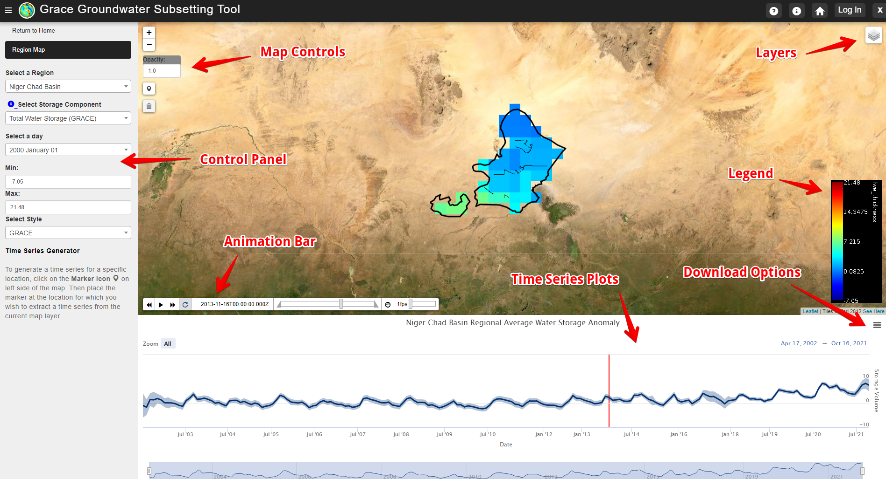

# **Overview**

The GGST app uses GRACE data to generate time series and animated maps
of groundwater storage changes. GRACE provides monthly estimates of
water storage anomalies in equivalent water height and has provided
monthly gravity field solutions since April 2002. Estimates of mass
variability and associated observational errors are available on a
global 300 km grid. GRACE has proved an effective tool for
characterizing groundwater storage changes in large regions ([J.
Famiglietti et al.,
2011](https://agupubs.onlinelibrary.wiley.com/doi/full/10.1029/2010GL046442);
[J. S. Famiglietti, 2014](https://www.nature.com/articles/nclimate2425);
[Rodell, Velicogna, & Famiglietti,
2009](https://www.nature.com/articles/nature08238); [Thomas, Reager,
Famiglietti, & Rodell,
2014](https://agupubs.onlinelibrary.wiley.com/doi/full/10.1002/2014GL059323)).

While several tools have been developed for processing and visualizing
GRACE data, GGST is designed specifically to support groundwater
resource management by regional stakeholders and decision-makers. We
accomplish this by carefully processing the raw GRACE data to remove
anomalies and improve resolution. This is done by separating the
groundwater component from the other water storage components using
GLDAS, subsetting the data to specific regions of interest, and by
presenting the results in a simple, intuitive interface. The algorithm
we use to process the GRACE and GLDAS data to produce groundwater
anomalies on both a global and regional scale is described in detail on
the Algorithm page.

You can access GGST using the Tethys Web Application or by using the API
and the associated Google Colaboratory Notebook that makes the API
intuitive to use. A brief introduction to these two methods is provided
below.

## **GGST Web Application**

The GGST web application was built using [Tethys
Platform](https://www.tethysplatform.org). Tethys is a web-based
application development framework for rapid deployment of
end-user-focused tools that follow modern, consistent, scalable,
cross-platform, reusable, web programming paradigms. Tethys is built on
commonly used web programming frameworks (e.g., Django, GeoServer,
PostGIS, OpenLayers). It is an open-source platform which allows anyone
to observe and use the GGST as a decision support system to ensure
sustainable usage of groundwater. It was developed in the [BYU
Hydroinformatics Laboratory](https://hydroinformatics.byu.edu/) and is
now supported by a growing user and developer community. To access the
GGST web application, visit <https://apps.geoglows.org>.

Anyone can open the app to view the currently uploaded regions and
download the timeseries plots. View the screenshot below to see how to
manipulate the map and download the data. Users can change the storage
component displayed and the color bar style. Use the animation bar to
view the storage change over time. Users can also download the time
series plots as an image or as a table. The web app does not yet support
downloading the NETCDF file raster that is displayed but this can be
downloaded using the API.

To upload and delete regions from the Tethys web application you must
login with an administrator (admin) account. If you have admin access,
follow the instructions on the Adding and Delete Regions page. If not,
consider using our API method or feel free to contact us if you would
like a region uploaded (Norm Jones, <njones@byu.edu>).

The GGST app can be accessed in the following locations:

-   **SERVIR West Africa Portal**: Official Tethys portal hosted by the
    SERVIR Science Coordination Office (SCO) for the West Africa Hub
    (<https://tethyswa.servirglobal.net/apps/>).
-   **BYU Portal**: A Tethys portal hosted by Brigham Young University
    for all experimental web applications developed by the BYU
    Hydroinformatics Lab (<https://tethys.byu.edu>).
-   **GEOGloWS Portal**: A portal associated with the GEOGloWS
    organization (<https://apps.geoglows.org/apps/>).

## **API and Google Colaboratory Notebook**

In addition to using the GGST web application through one of the portals
noted previously, it is also possible to access the core functionality
of the GGST tool through a Python programming language-based application
programmer interface (API). The advantages of the API are that you can
retrieve data about a new region of interest without having admin access
to the Tethys web application. You can also download a complete zip file
of the regions netCDF raster files. You may implement the API on your
own, but we recommend using the Google Colaboratory Notebook hosted on
GitHub which is designed to run each of the API functions and help you
download and visualize the data. For more detailed documentation please
visit our API page. Below is a gif produced of the Niger Chad Basin
using our Google Colab Notebook. Google Colaboratory is a web based
Python programming environment hosted in the Google Cloud that is a
component of the Google Drive environment.

