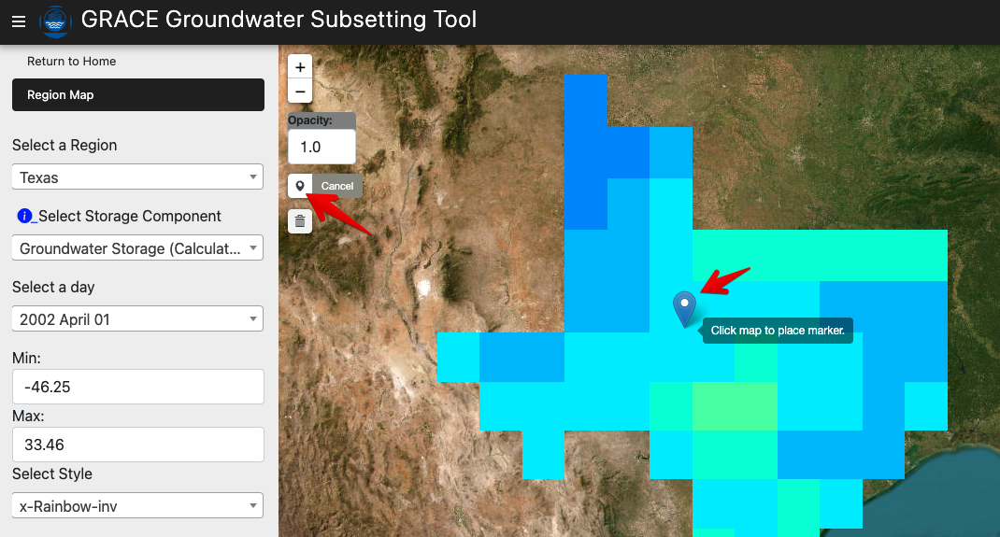
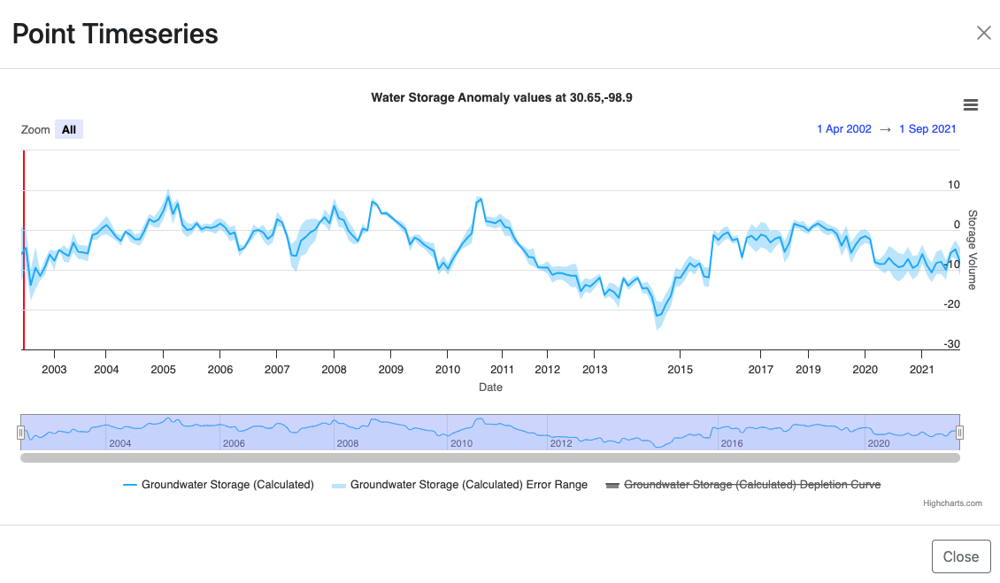
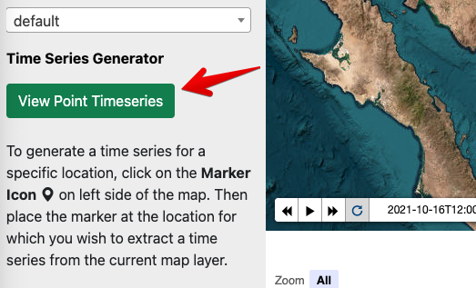
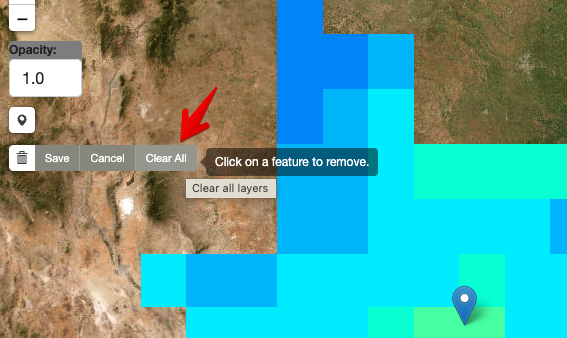
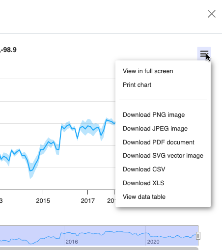

# **Analysis at a Single Point**

In addition to analyzing groundwater storage change averaged over a
region, the GGST app can be used to perform an analysis at a single
point location. This can be used to quickly generate a time series at a
point of interest or in cases where a region of interest is too small to
be processed using the Upload Region feature. For a point analysis, GGST
finds the GRACE and GLDAS grid cells containing the selected point and
returns the selected dataset time series for the cell.

## **Selecting a Point**

Before performing a point analysis, you should first zoom in to your
area of interest. You can do this using either the global view, or by
selecting a region that has previously been uploaded. You should then
select the desired storage component using the \"Select Storage
Component\" option. These options will include: Total Water Storage
(GRACE), Surface Water Storage (GLDAS), Soil Moisture Storage (GLDAS),
and Groundwater Storage (Calculated). After selecting a component, click
on the Select Point tool and then click on the map where you wish to
perform a point analysis. If you are viewing a region, the selected
point must be within the bounds of the region.

After clicking on a point, a time series plot for the selected storage
component at the point location appears:

If the Time Series window is closed, it can be relaunched using the
\"View Time Series\" button on the left.

To perform a time series analysis at a new point, close the Time Series
window and click on a new point while the Select Point tool is active.

## **Moving or Deleting a Point**

To delete an existing point, click on the Delete tool and select the
\"Clear All\" option.

## **Exporting a Time Series**

To export the data associated with a point time series, click on the
menu icon in the upper right corner of the Time Series window and export
to the selected format:

When exporting a time series, the data in the time series are saved to a
tabular file with columns for the date, and each component of the time
series is exported as a separate column. The date column is saved in a
unique format representing the number of milliseconds since January 1,
1970. This can be converted to a more typical date format using a
spreadsheet formula. This process is described in the [Water Table
Fluctuation
Method](https://ggst.readthedocs.io/en/latest/wtf.html#downloading-the-water-level-time-series-from-the-ggst-app)
section.
