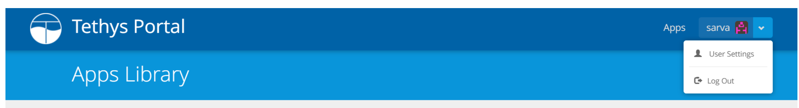
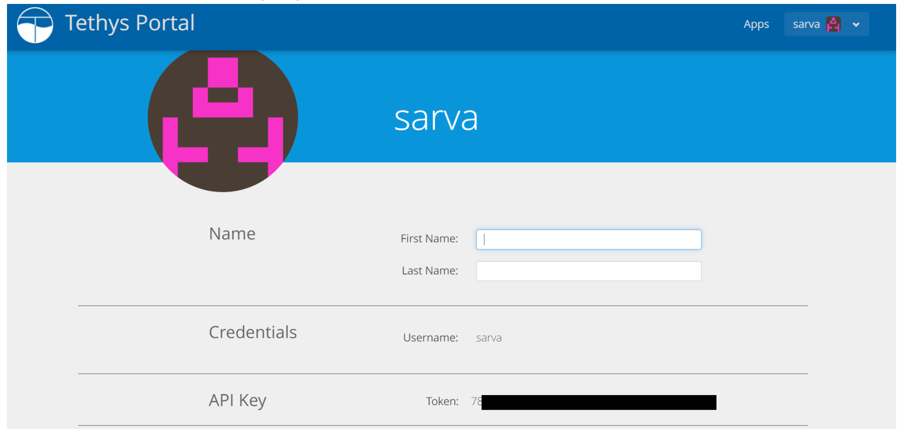
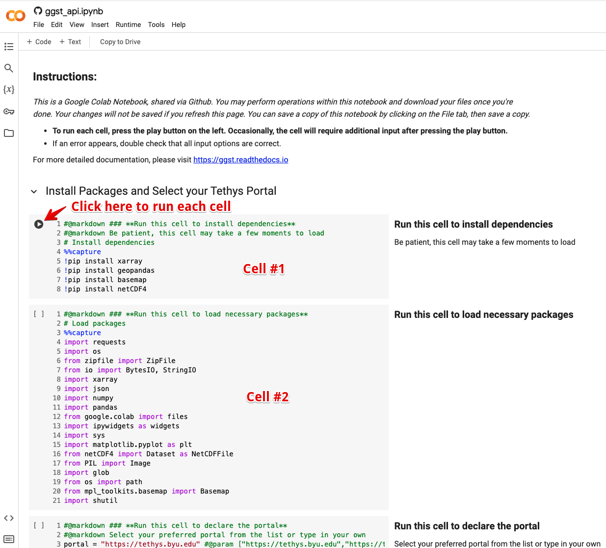
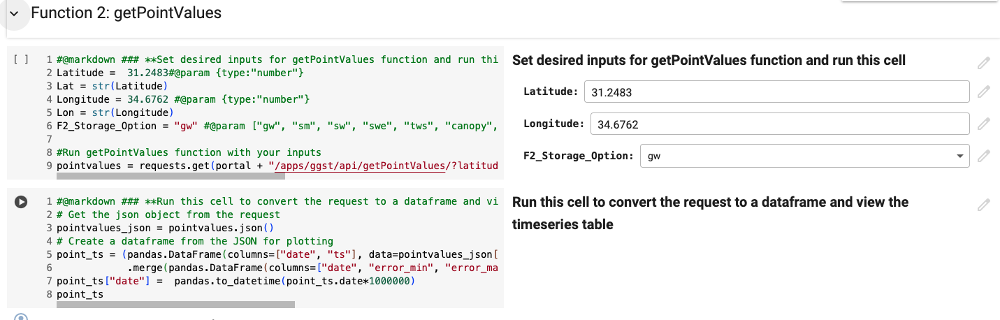
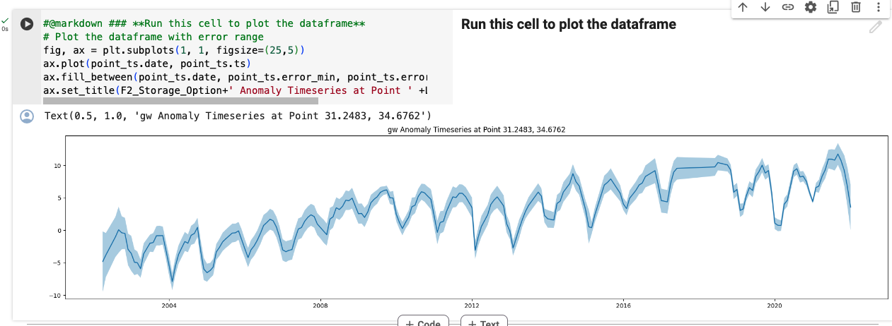
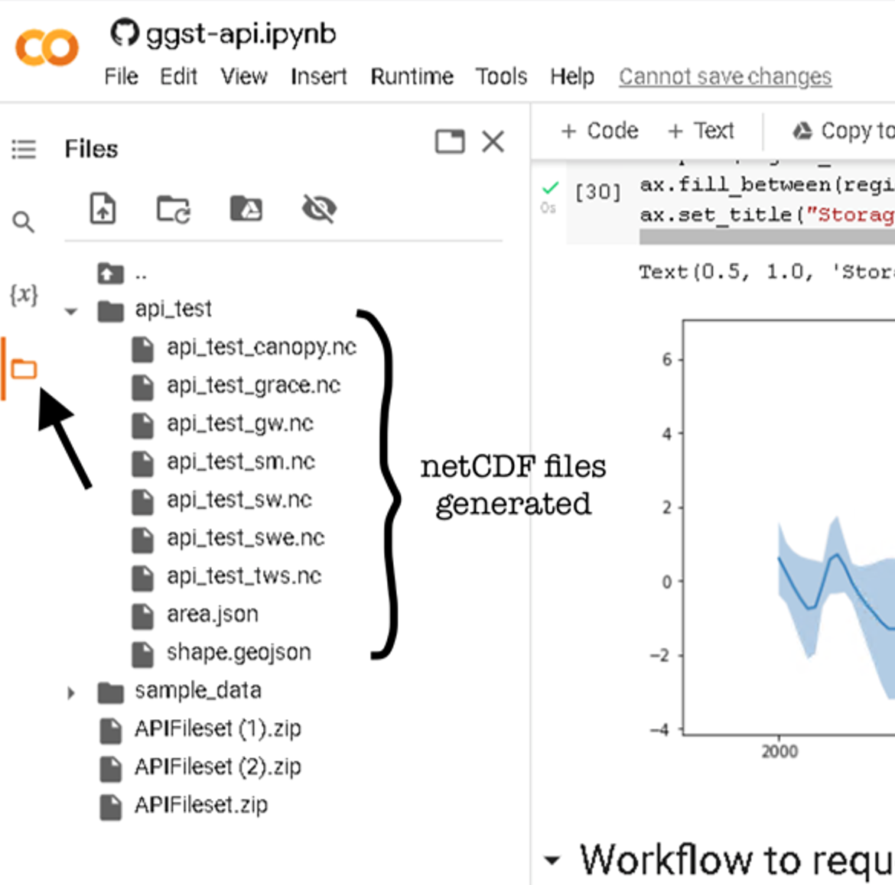

.. raw:: html
   :file: translate.html
   
**Application Programming Interface (API)**
=================================
The Python API for the GGST allows users to retrieve ground water information about a point or region without having administrative privileges to the GGST web application. The GGST API has four functions. Each of these functions requires different inputs and returns different results as desired by the user. The name of each function gives a glimpse of what each accomplishes. The four functions are:

* getStorageOptions
* getPointValues
* getRegionTimeseries
* subsetRegionZipfile

To run some of the functions listed above, the user will need an authentication token. Please refer to section 4.2 of this documentation on how to obtain the said token. The API can be implemented in many ways using a variety of coding languages and platforms. An example implementation using the Python code language in a Google Colaboratory notebook has been provided below. Before using the API in the Google Colaboratory notebook, each of the four GGST API methods will be explored in the following section.
    
**API Methods**
-------
All four GGST functions follow the same pattern as shown by the URL examples below. Each of the terms in brackets along with the parameters and values would be replaced by string values.

.. raw:: html
https://tethys-staging.byu.edu/apps/[parent-app]/api/[MethodName]/?param1=value1&param2=value2&...paramN=valueN

To test the API, the user will need a zip file of the region of interest. We have provided a set of sample files in the appropriate format. You may use your own files if you choose so.

:download:`API_Fileset.zip </test_files/API_Fileset.zip>`

Let's explore each API method individually and offer an example:

1. **The getStorageOptions Method**

+------------------------+-----------------------------------------------------------+            
| **Parent Application** | GGST                                                      |
+------------------------+-----------------------------------------------------------+
| **Supported Methods**  | GET                                                       |
+------------------------+-----------------------------------------------------------+
|**Returns**             | A JSON object with a list of storage options              |
+------------------------+-----------------------------------------------------------+
| **Parameters**     | There are no parameters for the getStorageOptions function|
+------------------------+-----------------------------------------------------------+

Follow this link to inspect the JSON returned which lists the list of the storage options available:

https://tethys-staging.byu.edu/apps/ggst/api/getStorageOptions/

For simplicity, the options are given a variable name. For instance, the "Total Water Storage (GRACE)" has a variable name of "grace", and similarly the "Soil Moisture Storage (GLDAS)" is shortened to "sm".

2. **The getPointValues Method**

+------------------------+----------------------------------------------------------------------------------------------------------------------------------------+            
| **Parent Application** | GGST                                                                                                                                   |
+------------------------+----------------------------------------------------------------------------------------------------------------------------------------+
| **Supported Methods**  | GET                                                                                                                                    |
+------------------------+----------------------------------------------------------------------------------------------------------------------------------------+
|**Returns**             | A JSON object with a timeseries for a given point                                                                                      |
+------------------------+-------------+--------------------------+--------------------------------------------------------------------------------+--------------+
| **Parameters**         | **Name**    | **Description**          | **Valid Value**                                                                | **Required** |
+                        +-------------+--------------------------+--------------------------------------------------------------------------------+--------------+                        
|                        | Longitude   | long in WGS 84 Proj      | Any value on land with the GRACE Explorer Doman (-60,180)                      | Yes          |
+                        +-------------+--------------------------+--------------------------------------------------------------------------------+--------------+
|                        |Latitude     | lat in WGS 84 Proj       | Any value on land with the GRACE Explorer Doman (-60,90)                       | Yes          |
+                        +-------------+--------------------------+--------------------------------------------------------------------------------+--------------+
|                        | storage_type| Storage type of interest | One of the abbreviated values from the first function. eg. grace, sw, sm or gw | Yes          |
+------------------------+-------------+--------------------------+--------------------------------------------------------------------------------+--------------+

Click on the following example link to call the API and inspect the JSON object returned (results will appear in a new window):

https://tethys-staging.byu.edu/apps/ggst/api/getPointValues/?latitude=20.7&longitude=80.2&storage_type=gw

For the last two functions, the user will need to have an authentication token as it is required to run the code. It is best to call these two functions from Python. Please refer to the Google Colab Notebook for further instructions. See details below on how to obtain one.

3. **The getRegionTimeseries Method**

+------------------------+-----------------------------------------------------------------------------------------------------------------------------------------------------------------------------------------------+           
| **Parent Application** | GGST                                                                                                                                                                                          |
+------------------------+-----------------------------------------------------------------------------------------------------------------------------------------------------------------------------------------------+
| **Supported Methods**  | POST                                                                                                                                                                                          |
+------------------------+-----------------------------------------------------------------------------------------------------------------------------------------------------------------------------------------------+
|**Returns**             | A JSON object with area of the region, depletion time series, error range timeseries and storage time series                                                                                  |
+------------------------+------------------------+---------------------------------------------------------------------+---------------------------------------------------------------------------------+--------------+
| **Parameters** | **Name**               | **Description**                                                     | **Valid Value**                                                                 | **Required** |
+                        +------------------------+---------------------------------------------------------------------+---------------------------------------------------------------------------------+--------------+                        
|                        | Region name            | Name for the subset region. All files will have this name as prefix | String                                                                          | Yes          |
+                        +------------------------+--------------------------+------------------------------------------+---------------------------------------------------------------------------------+--------------+
|                        |Storage type            | storage type of interest                                            |  One of the abbreviated values from the first function. eg. grace, sw, sm or gw | Yes          |
+                        +------------------------+--------------------------+------------------------------------------+---------------------------------------------------------------------------------+--------------+
|                        | files                  | A zipped folder                                                     | a zipped folder with .shp, .shx, .prj and .dbf files                            | Yes          |
+                        +------------------------+---------------------------------------------------------------------+---------------------------------------------------------------------------------+--------------+
|                        | API token              |  token from the  tethys portal                                      | token from a tethys user account on the portal                                  | Yes          |
+------------------------+------------------------+--------------------------+------------------------------------------+---------------------------------------------------------------------------------+--------------+

Example query: files = {'shapefile': ("response.zip", uploaded["".join(uploaded)],'application/zip')} region_timeseries_request = requests.post("https://tethys-staging.byu.edu/apps/ggst/api/getRegionTimeseries/", headers={"Authorization": f"Token {api_token}"}, data = {"name":"api_test", "storage_type": "tws"}, files=files) Response (trimmed for clarity): {'area': 437109427476.4769, 'depletion': [['2000-01-01', 0.0], ['2000-02-01', -273831.117], ['2000-03-01', -661208.652], …….. ['2021-09-01', 4792246.794]], 'error_range': [['2000-01-01', -6.045, -3.205], ['2000-02-01', -7.122, -3.798], ['2000-03-01', -8.648, -4.636], ['2021-09-01', 8.19, 11.796]], ……. 'success': 'success', 'values': [['2000-01-01', -4.625], ['2000-02-01', -5.46], …….. ['2021-09-01', 9.993]]}

4. **The subsetRegionZipfile  Method**

+------------------------+-----------------------------------------------------------------------------------------------------------------------------------------------------------------------------------------------+           
| **Parent application** | GGST                                                                                                                                                                                          |
+------------------------+-----------------------------------------------------------------------------------------------------------------------------------------------------------------------------------------------+
| **Supported Methods**  | POST                                                                                                                                                                                          |
+------------------------+-----------------------------------------------------------------------------------------------------------------------------------------------------------------------------------------------+
|**Returns**             | A zip file with regional netCDF files for each storage option clipped to the uploaded shapefile.                                                                                              |
+------------------------+------------------------+---------------------------------------------------------------------+---------------------------------------------------------------------------------+--------------+
| **Parameters(Params)** | **Name**               | **Description**                                                     | **Valid Value**                                                                 | **Required** |
+                        +------------------------+---------------------------------------------------------------------+---------------------------------------------------------------------------------+--------------+                        
|                        | Region name            | Name for the subset region. All files will have this name as prefix | String                                                                          | Yes          |
+                        +------------------------+--------------------------+------------------------------------------+---------------------------------------------------------------------------------+--------------+
|                        | files                  | A zipped folder                                                     | a zipped folder with .shp, .shx, .prj and .dbf files                            | Yes          |
+                        +------------------------+---------------------------------------------------------------------+---------------------------------------------------------------------------------+--------------+
|                        | API token              |  token from the  tethys portal                                      | token from a tethys user account on the portal                                  | Yes          |
+------------------------+------------------------+--------------------------+------------------------------------------+---------------------------------------------------------------------------------+--------------+
Here is an example query using the subsetRegionZipfile method.

Example Query: files = {'shapefile': ("response.zip", uploaded["".join(uploaded)],'application/zip')} subset_region_request = requests.post("https://tethys-staging.byu.edu/apps/ggst/api/subsetRegionZipfile/", headers={"Authorization": f"Token {api_token}"}, data = {"name":"api_test"}, files=files) z = ZipFile(BytesIO(subset_region_request.content)) z.extractall()

Result will be a folder with nc files.

**Obtaining an Authentication Token**
---------------------------------------
The last two functions of the API require an authentication token. To obtain one, you will need to sign up for an account on `BYU Tethys Portal <https://tethys-staging.byu.edu/apps/>`_. Click on the Log In button to get to the sign-up prompt.

Once signed in, click on your username in the upper right corner, opening a panel. Click on the User Settings to reveal the API key.

  
The authentication token or API key will be in the third section.

   
For privacy reasons, we have hidden the remaining characters of this user's token.

It is also possible to request an authentication token directly from an administrator. We recommend using the sign up method as it is faster.

**GGST API Google Colaboratory Notebook**
-----------------------------------------
We have provided an example of calling the GGST API using the Python coding language in a Google Colab Notebook. You can open the notebook with this link:

.. raw:: html

    

You may wish to make a copy of the notebook in your own Google Drive.

Run each cell of the notebook by hitting the play button on the left side of each cell and provide the necessary inputs by following the prompts. The notebook runs through all four of the API functions we described above. To run some of the functions in this notebook, the user will have to sign up for a Tethys account and obtain an authentication token (API key) as explained in the previous sections.

The notebook is divided into multiple sections and each section contains a set of cells, each of which contains Python code. When you first launch the notebook, the sections are collapsed and you need to expand each section to view and run the code:

.. image:: images-api/colab_sections.png
   :scale: 50%

The cells should be run sequentially. To run a cell, click on run arrow in the upper left corner of the cell:

Some cells require inputs as shown on the right side. You should enter the inputs before running the associated cells:

Some cells produce outputs when you run the cell. The outputs are displayed just below the cells:

The code is divided into six sections designed to help the user understand how to call each of the four functions and how to plot and visualize them.

+ **Install Packages and Select your Tethys Portal**:
      In this section, dependencies and other python packages are installed and set up for the processing of the shapefile and rendering of the graph in latter cells.
      The dropdown menu lists all the available portals. A portal is a web hosting platform that executes the commands and returns the results as requested by the user. For this API, three portals are available: the Tethys staging, Tethys main and the tethys West Africa. The first two are maintained by the Brigham Young University Hydroinformatics Laboratory and the last by the SERVIR program in West Africa. The Tethys staging portal is the testing ground for web applications developed by the BYU Hydroinformatics Laboratory before committing them to the two main portals.

+ **Function 1: getStorageOptions**
       This cell lists all the available options and how to properly declare them in the appropriate cell.

+ **Function 2: getPointValues**
       The user types in latitude and longitude coordinates and selects the desired storage option from a drop-down menu. The next several cells will            create a dataframe, chart the timeseries, and plot a graph with estimated error bars.

+ **Requesting Info for Regional Functions 3 and 4**
       The last two functions are regional functions and require more inputs to run. This section of the notebook walks you through inputting that                additional information. First, you will be asked for your API token which must match your declared portal to work. Second, you will be asked to            give your region a name that will be used in naming the files. Lastly, you will be asked to upload a zipped shapefile of the region of interest.          This should contain four files (a .shp, .shx, .prj and .dbf ) zipped in a single folder.

+ **Function 3: getRegionTimeseries**
       Asks for your desired storage option using a drop-down menu, calls the API, then displays an interactive table and graph of the data returned.

+ **Function 4: getRegionZipfile**
       Calls the API and returns a set of netCDF files which can be accessed from a tool bar on the left side of the screen as pictured below.

Visual guide on netCDF files:

 
 
This table elaborates on each of these files and their naming conventions:

.. list-table::

   * - **Name**  
     - **Abbreviation** 
     - **Source**
     - **Source Resolution**
   * - Total Water Storage 
     - grace	
     - GRACE
     - 0.5 degrees 
   * - Surface Water Storage
     - sw
     - GLADAS
     - 1.0 degrees
   * - Soil Moisture Storage
     - sm
     - GLADAS
     - 1.0 degrees
   * - Groundwater Storage
     - gw
     - Calculated* 
     - 1.0 degrees 
   * - Snow Water Equivalent 
     - swe
     - GLADAS
     - 1.0 degrees
   * - Terrestrial Water Storage 
     - tws
     - GLADAS
     - 1.0 degrees
   * - Canopy Storage 
     - canopy
     - GLADAS
     - 1.0 degrees

*To learn more about how this is calculated please visit our Computational Algorithm page.

This section will also help you create a dataframe, plot your data, and visualize your data on an animated map.

     

     

