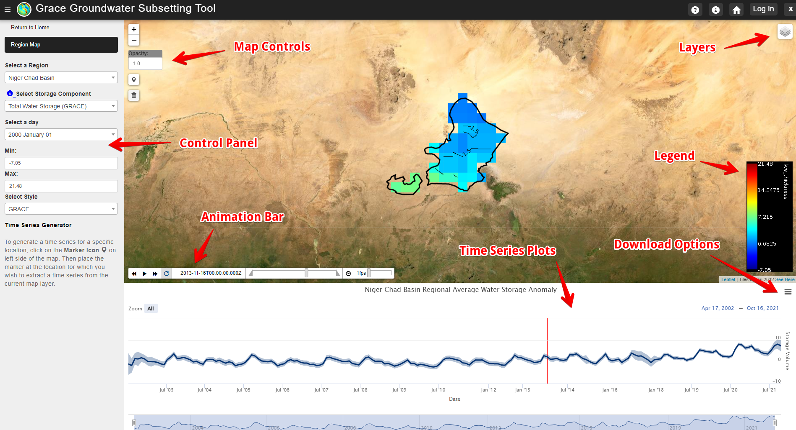

.. raw:: html
   :file: translate.html
   
**INTRODUCTION**
================

The GRACE Groundwater Subsetting Tool (GGST) uses data from the NASA Gravity Recovery And Climate Experiment (GRACE) mission to analyze long-term groundwater storage change for selected regions. GGST can be used to identify and characterize conditions in data-poor areas or identify trends in other regions where trends can be obscured by noise from well data. GGST uses GRACE mission data to compute and display changes in water storage in a web-based mapping system and integrates data from both the GRACE and GRACE-FO missions. GGST uses NASA GLDAS surface water data to derive groundwater storage changes. It accepts shapefiles to define regions representing countries, basins, or aquifers. It then aggregates the water volume changes in those regions and displays the results as time series plots for the whole region or at selected points. It also displays an animated map of the storage change anomalies.

**Objective**
--------------
The GGST app uses GRACE data to generate time series and animated maps of groundwater storage changes. GRACE provides monthly estimates of water storage anomalies in equivalent water height and has provided monthly gravity field solutions since April 2002. Estimates of mass variability and associated observational errors are available on a global 300 km grid. GRACE has proved an effective tool for characterizing groundwater storage changes in large regions (J. Famiglietti et al., 2011; J. S. Famiglietti, 2014; Rodell, Velicogna, & Famiglietti, 2009; Thomas, Reager, Famiglietti, & Rodell, 2014).

While a number of tools have been developed for processing and visualizing GRACE data, our tool is designed specifically to support groundwater resource management by regional stakeholders and decision-makers. We accomplish this by carefully processing the raw GRACE data to remove anomalies and to improve resolution. This is done by separating the groundwater component from the other water storage components using GLDAS, by subsetting the data to specific regions of interest, and by presenting the results in a simple, intuitive interface. The algorithm we use to process the GRACE and GLDAS data to produce groundwater anomolies on both a global and regional scale is described in detail in the Algorithm page.

You can access GGST using the Tethys Web Application or by using the API and the associated Google Colab Notebook that makes the API intuitive to use. A brief introduction to these two methods is provided below.

**Tethys Application**
-----------------------
GGST was built using the Tethys Platform. Tethys is a web-based application development framework for rapid deployment of end-user-focused tools that follow modern, consistent, scalable, cross-platform, reusable, web programming paradigms. Tethys is built on commonly used web programming frameworks (e.g., Django, GeoServer, PostGIS, OpenLayers). It is open source platform which allows anyone to observe and use the GGST as a decision support system to ensure sustainable usage of groundwater. It was developed in the BYU Hydroinformatics laboratory and is now supported by a growing user and developer community. To access the GGST web application, please visit https://tethys.byu.edu/apps/ggst/ .

Anyone can open the app and view the currently uploaded regions and download the timeseries plots. View the screenshot below to see how to manipulate the map and download the data. You can change the storage component displayed and the color bar style. Use the animation bar to view the storage change over time. You can also download the time series plots as an image or as a table. The web app does not yet support downloading the NETCDF file raster that is displayed but this can be downloaded using the API.

**API and Google Colab Notebook**
---------------
The advantages of the API are that you can retrieve data about a new region of interest without having admin access to the Tethys web application. You can also download a complete zipfile of the regions NETCDF raster files. You may implement the API on your own but we recommend using our Google Colab Notebook hosted on Github which is designed to run each of the API functions and help you download and visualize the data. For more detailed documentation please visit our API page. Below is a gif produced of the Niger Chad Basin using our Google Colab Notebook.
Nah

.. toctree::
    :maxdepth: 2
    :hidden:
    :caption: TABLE OF CONTENT

    self
    algorithm
    uploading
