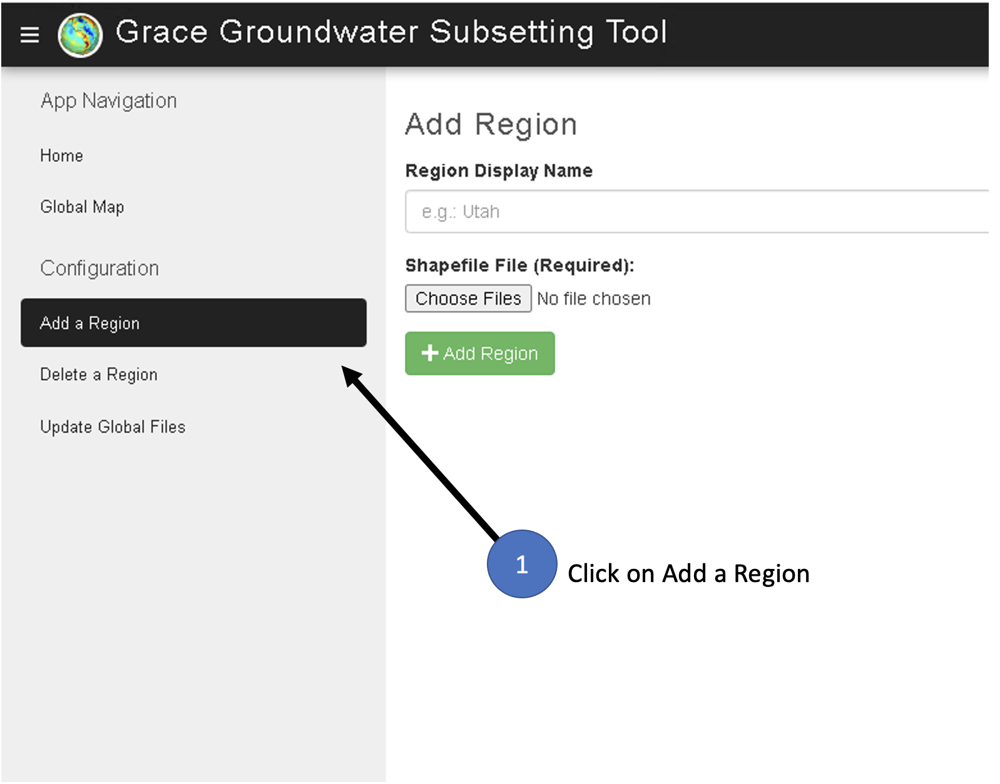

.. raw:: html
   :file: translate.html

**ADDING AND DELETING REGIONS**
====

**Uploading a Region**
-----------------------
The Grace Groundwater Subsetting Tool web application is be hosted on three different Tethys portals:

* **Servir West Africa Portal**: official Tethys portal hosted by the SERVIR Science Coordination Office (SCO) for the West Africa Hub (https://tethyswa.servirglobal.net/apps/)
* **BYU Main Portal**: a Tethys portal hosted by Brigham Young University for all completed apps (https://tethys.byu.edu)
* **BYU Staging Portal**: a Tethys portal hosted by Brigham Young University for testing new applications or features (https://tethys-staging.byu.edu/apps/)
To upload regions on the application, visit the portal of your choice and log in. Without logging in you can see the App Navigation pages: Home and Global Map. These allow you to view previously uploaded regions and create time series graphics for any singular point on the globe. Once you log in with administrative privileges, you will see the additional Configuration pages: Add a Region, Delete a Region and Update Global Files. Do not worry about the Update Global Files page, it runs automatically every month to look for new data from NASA. Proceed to the Add a Region page where this tutorial focuses.

To add a new region, the user will need to upload four files. Beware, the four files need to be selected all at once and should not zipped together.

Please refer to the following images as a visual guide:

**Deleting a Region**
---------------------
Deleting a region is very simple. Proceed to the Delete a Region page. Select the region from the drop down menu and hit the delete button. A message will display when the deletion has been completed.

