.. raw:: html
   :file: translate.html

**The Water Table Fluctuation Method**
=====================================
In addition to obtaining the GRACE-derived groundwater storage anomaly, it is possible to analyze the storage anomaly time series to extract an estimate of annual recharge using a technique called the Water Table Fluctuation (WTF) method. The WTF method was originally developed to estimate recharge from seasonal fluctuations in groundwater levels measured directly in monitoring wells. When a water level time series exhibits seasonal fluctuations as shown below, it is assumed that the declining period during the dry part of the year results from pumping and groundwater discharge, and the rise during the wet part of the year is the result of recharge.

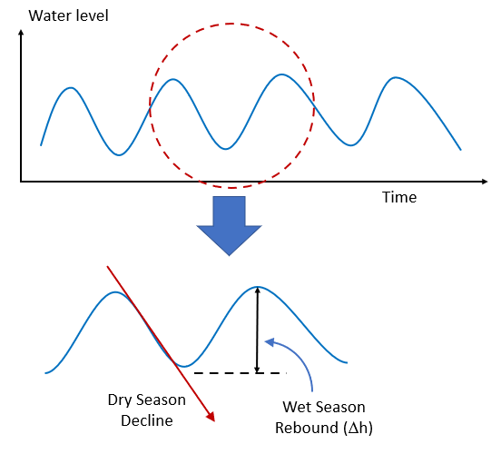

Using water levels derived from a monitoring well, we can estimate the recharge as follows:

.. math::
      R = S_y \frac{\Delta h}{t}
  
where Δh is the rebound in water level, t is the time period (typically one year) and Sy is the specific yield or appropriate storage coefficient.

The storage coefficient is necessary because the water level rise in the surrounding aquifer occurs in the fractional void space and the storage coefficient converts it to the appropriate liquid water equivalent component in the [length]/[time] infiltration rate units used by recharge. If we perform this analysis using the groundwater storage anomaly curve derived from GRACE, we do not need to use a storage coefficient as the anomaly is already in liquid water equivalent form and we can directly estimate the recharge as:

.. math::
      R = \frac{\Delta GWSa}{\Delta t}

where ΔGWSa = the rise in groundwater extracted from the GRACE-derived groundwater storage anomaly curve.

**Methods for Estimating Recharge Component**
--------------------------------------------
There are two general approaches for determining the height of the rise associated with recharge:

With the more conservative method, the rise is measured from the trough to the next peak as follows:

.. math::
      R_{method_1} = \frac{\Delta GWSa}{\Delta t} = \frac{S_p-S_B}{\Delta t } = R_S
  
Another method is to assume that the groundwater decline as a result of pumping and discharge continues at the same rate in the wet season and therefore the rise should be computed from a linear extrapolation of the declining line as follows:

.. math::
      R_{method_2} = \frac{\Delta GWSa}{\Delta t} = \frac{S_p-S_L}{\Delta t } = R_S + R_D
  
The recharge rates extracted from these two equations could be considered a low and a high estimate, although in our experience method 1 seems to be the most accurate. An example of applying the WTF method to estimate recharge in Southern Niger can be found : `Evaluating Groundwater Storage Change and Recharge Using GRACE Data: A Case Study of Aquifers in Niger, West Africa <https://www.mdpi.com/2072-4292/14/7/1532>`_.

**Downloading the Water Level Time Series from the GGST App**
---------
To apply the WTF method to estimate recharge on GRACE data, one must first download the groundwater storage anomaly time series from the GGST app. To do so, first load the region and select the Groundwater Storage (Calculated) storage component and then click on the three stacked lines in the upper right corner of the storage anomaly time series displayed and then download the time series as either a comma separated values (CSV) file or an Excel (XLS) file.

The storage anomaly chart is created, displayed, and downloaded using the HighCharts plugin. The format of the resulting downloaded file is as follows:

The storage units are liquid water equivalent in cm, as expected, but the date units are reported in milliseconds since Jan 1, 1970. In order to convert to a more typical date unit, we must first create a new column and then enter the formula shown below for the first date in the list. This formula converts the number from milliseconds to days and then adds that number to the date value corresponding to January 1, 1970, thus creating a proper date value. To see this value, change the number format to the one of the standard date options. Whether it appears as month/day/year or day/month/year will depend on your regional settings.

**Downloading the Water Level Time Series from the API Google Colab Notebook**
------------------------------------------------------------------------------
You can also download the time series directly from the sample Colab API Python script. After uploading a region shapefile and then generating and plotting the storage anomaly time series, run the line of code to export the Python Pandas data frame containing the time series to a CSV file.

This file will then appear in the files section of the Colab interface on the left. Click the three vertical dots to the right of the file and select the Download option.

In this case, the resulting CSV file has the dates in the correct format and no changes are necessary.

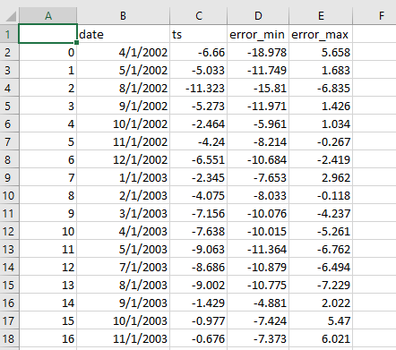

**Gaps in the GRACE Data**
--------------------------
If you carefully inspect the groundwater storage time series CSV file, you will see that there are several missing months or gaps in the data. For example, the month of June is missing in 2003:

This is because there were periods when the GRACE satellites did not produce usable data. The largest gap is a 12-month period in 2017-2018 between the end of the original GRACE mission in 2017 and when the subsequent GRACE-FO satellites were launched and became operational in 2018. Here is a sample plot for an aquifer in Southern Niger with the gaps shown:

For the years with large gaps, it can be difficult to identify seasonal trends and apply the WTF method. One way to resolve this problem is to use a statistical algorithm to detect seasonal patterns in the data and impute synthetic data in the gaps. This can be accomplished using a simple seasonal decomposition model (statsmodels.tsa.seasonal.seasonal_decompose) implemented in the statsmodels Python package to impute the missing data. This model first removes the trend using a convolution filter (the trend component), then computes the average value for each period (the seasonal component), in our case months, with the residual component being the difference between the monthly average (seasonal component) and the actual monthly measurements. With this approach, we decompose the GWSa time series into three components: the trend, the seasonal, and the random components:

.. math::
      Y [t] = T [t] + S [t] + e [t]
Where Y[t] is the GWSa, T[t] is the GWSa trend, S[t] is the seasonal GWSa component, and e[t] is the residual GWSa component. The decomposition components for the data shown above are as illustrated here:

To impute the missing data, we use the trend from the data decomposition, then add the average of the monthly and residual values for that month to estimate the missing value. This model can be written as:

.. math::
      Y[t] = y (T[t]) + \overline{S [t] + e[t]}
      
The following figure shows the original time series in black, with imputed values in red:

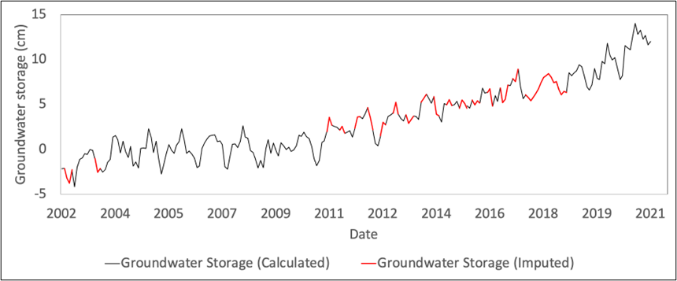

**Data Imputation Tools**
----
To assist users in applying the statsmodel method described above to impute gaps in the GRACE data, we have implemented the Python code to perform the imputation in a Google Colab notebook whose link is below. After launching the notebook, follow the instructions in the code.

.. raw:: html

    

Before running the code, you will need to prepare and upload a CSV file with the original data with the gaps. This file will need to contain only two columns, which you can copy and paste from the full CSV and then save as a separate CSV file ("base_file.csv" for example).

Furthermore, the code will automatically detect small gaps, but the large gap from 2017-2018 must be identified by creating empty rows in the file as follows:

At this point, the file is ready to be used with the Colab notebook. The following file is an example of a file prepared in the manner described above:

Here is a sample file you can use with the script: 
:download:`west-gwsa-raw-clean.csv </wtf_files/west-gwsa-raw-clean.csv>`

**Multi-Linear Trend Analysis**
--------------------------
In the seasonal decomposition method described above for gap imputation, a single linear trend was described. Here is the trend resulting from the sample file linked above with a single trend line:

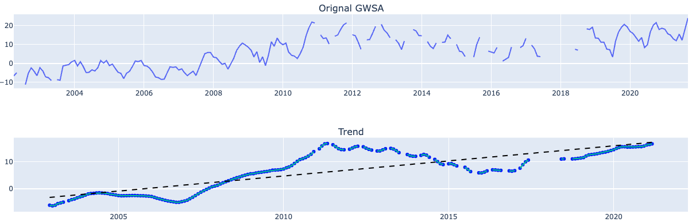

However, many data sets exhibit multiple linear trends. For this dataset, there are four distinct trends. The Python script has an option to perform a multi-linear regression analysis. For this dataset, we set the number_breakpoints variable to 3, and run a multi-linear regression algorithm that fits the data as follows:

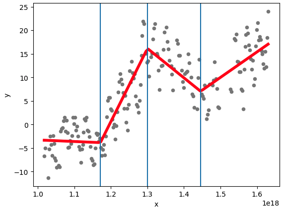

Note that 3 interior breakpoints result in four linear trends. This option results in the following trends:

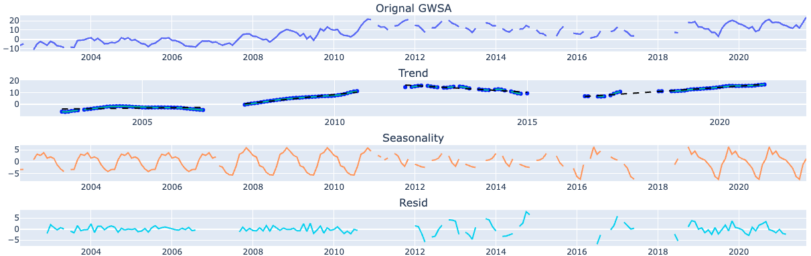

And finally, the gap imputation with 4 trend lines results in the following:

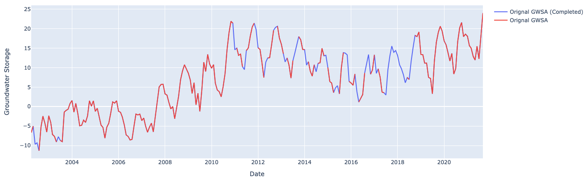

**Data Processing Examples**
------------
Once the gaps have been filled, the last step is to plot and analyze the curves one season at a time, extract the GWSa values from the curve, and calculate the recharge estimate using either method 1 and/or method 2.

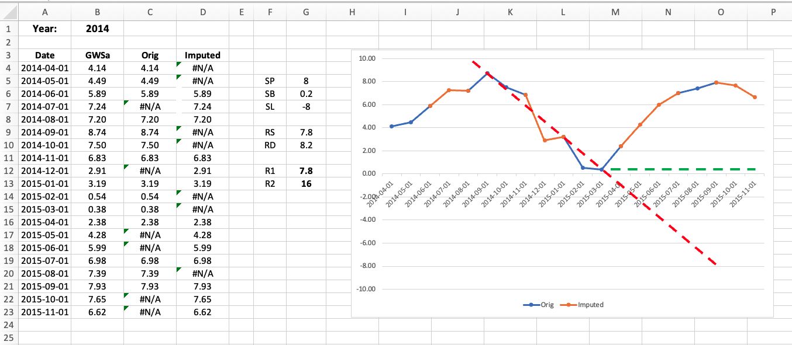

The following Excel file illustrates how to examine and process each season of data from a GRACE-derived and imputed groundwater storage anomaly time series:
:download:`west-gwsa-wtf.xlsx </wtf_files/west-gwsa-wtf.xlsx>`

After opening the file, copy-paste the GWSa values generated by the imputation algorithm as shown here. Note that the imputed values have more digits than the original values. The formulas in columns C & D separate the imputed data in column B to allow a multi-colored plot where the original imputed sections can be clearly visualized. 

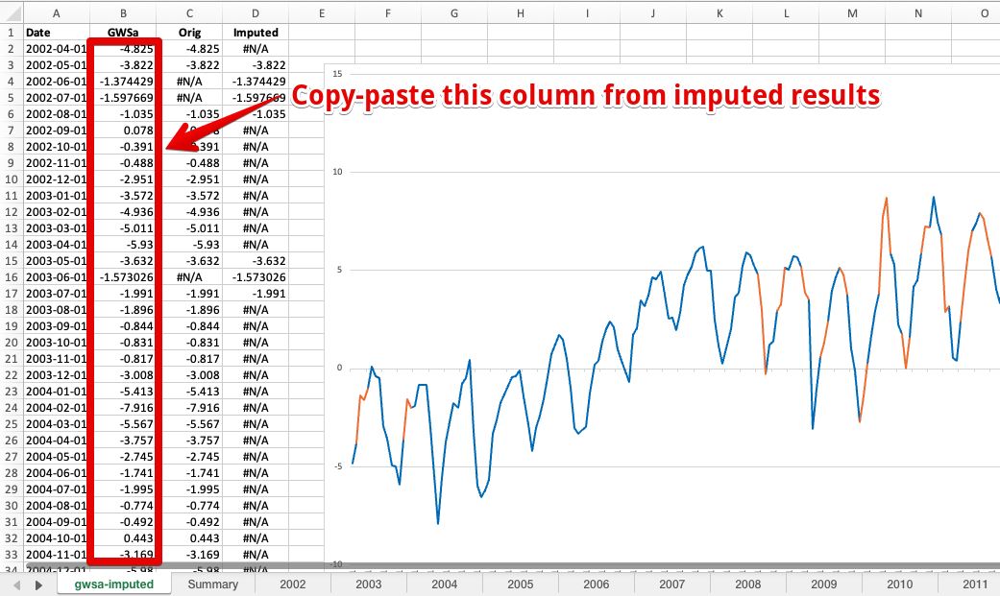

At this point you can browse through each of the tabs for the years starting in 2002. On each page, the seasonal values are automatically pulled from the main sheet using a VLOOKUP formula. For each page, manually adjust the red and green lines to fit the descending branch and the base. Then manually scale off the SP, SB, and SL values in cm from the vertical axis and enter into the three cells indicated in the diagram. The RS, RD, R1, and R2 values will then be automatically calculated. 

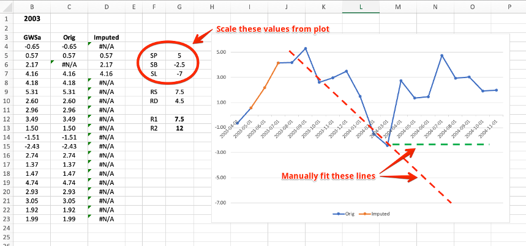

As you examine the plot for each year, you may need to adjust the range of the vertical axis before you can properly fit the lines. To do this, double-click on the vertical axis, click on the axis options tab, and manually adjust the minimum and maximum bounds to properly frame the plot.

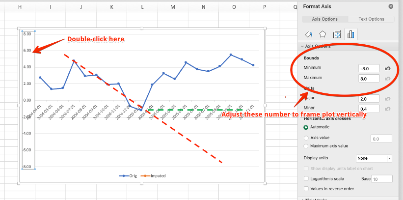

If you need to add additional years, copy one of the yearly sheets, rename it, and change the year at the top of the sheet. After processing all of the years and calculating all of the R1, R2 values, you can see a summary in the Summary sheet.

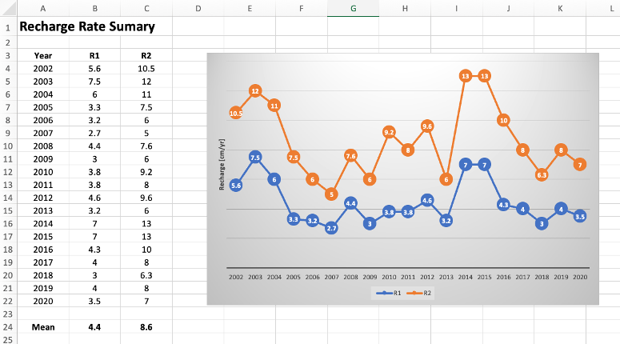
