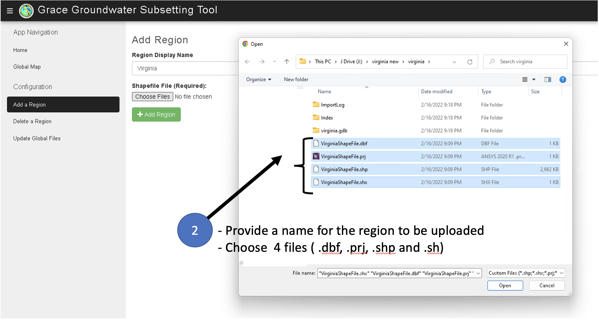
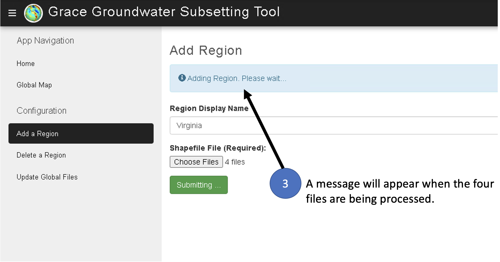

# **Adding and Deleting Regions**

This section describes how to upload new regions to the GGST app. When a
new region is uploaded, it is automatically processed and the storage
components including subsetting netCDF files and storage time series are
computed for the region and stored with the region for visualization in
the app. The new region is added to the list of regions for the app, and
it can be selected and viewed. This section also describes how to delete
regions and the associated files.

## **Uploading a Region**

The GRACE Groundwater Subsetting Tool web application is hosted on three
different Tethys portals:

-   **Servir West Africa Portal**: Official Tethys portal hosted by the
    SERVIR Science Coordination Office (SCO) for the West Africa Hub
    (<https://tethyswa.servirglobal.net/apps/>)
-   **BYU Main Portal**: A Tethys portal hosted by Brigham Young
    University for all completed apps (<https://tethys.byu.edu>).
-   **BYU Staging Portal**: A Tethys portal hosted by Brigham Young
    University for testing new applications or features
    (<https://tethys-staging.byu.edu/apps/>).

To upload regions on the application, visit the portal of your choice
and log in using the "Log In" link in the upper right corner of the
portal window.

Without logging in you can see the App Navigation pages: Home and Global
Map. These allow you to view previously uploaded regions and create time
series graphics for any singular point on the globe. Once you log in
with administrative privileges, you will see the additional
Configuration pages: Add a Region, Delete a Region, and Update Global
Files. Update Global Files is used to download the latest GRACE and
GLDAS files from the NASA server.

To add a new region, first prepare a shapefile for the region consisting
of four files: *.shp,*.dbf, *.prj, and*.shx. The projection for the
shapefile should be EPSG:4326 - WGS 84. The four files should not be
zipped together.

Please refer to the following images as a visual guide:

When uploading a region, it is recommended that the region be at least
3x3 degrees in size. Smaller regions can be processed, but the
uncertainty in the results increases. This is because the native GRACE
grid cells are 3x3 degrees in resolution before downscaling to 0.5x0.5
degrees. The GLDAS grid cells are 1x1 degree and therefore the resulting
Groundwater Storage Anomaly (GWSa) cells are 1x1 degree resolution. When
uploading a region, the GGST algorithm searches to global GRACE and
GLDAS grid cells to find cells where the centroid of the cells falls
within the region shapefile. If the region is so small that no grid
cells are found, the following error message is displayed:

## **Deleting a Region**

Deleting a region is very simple. Proceed to the Delete a Region page.
Select the region from the drop-down menu and hit the delete button. A
message will display when the deletion has been completed.

