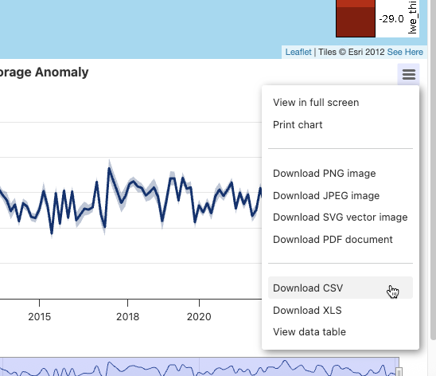
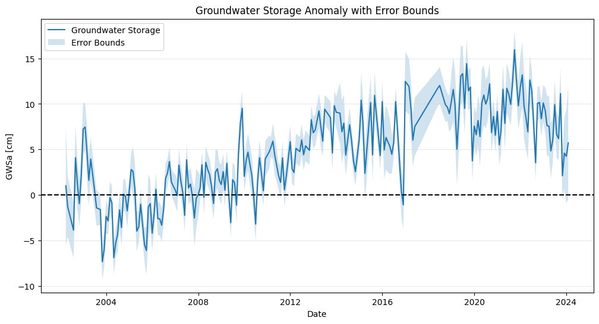
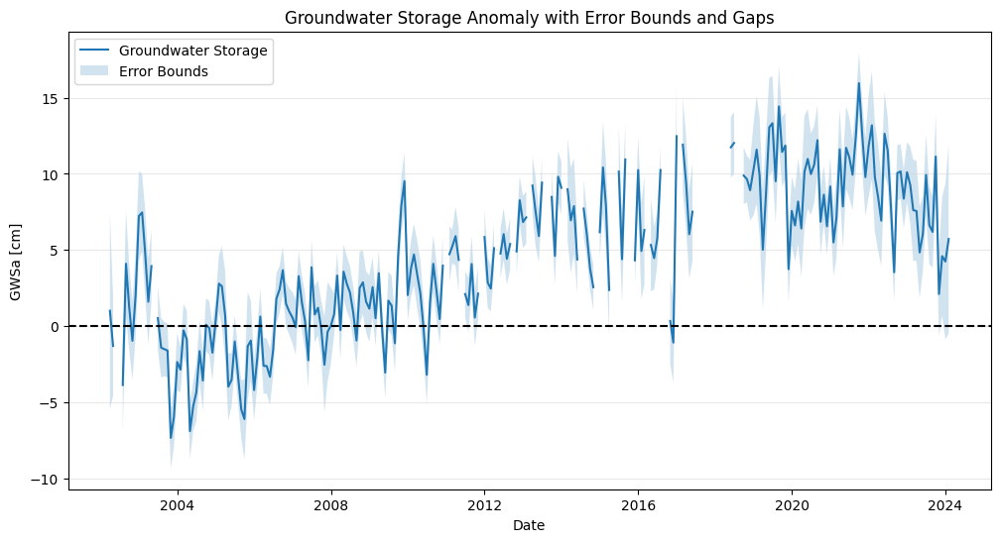
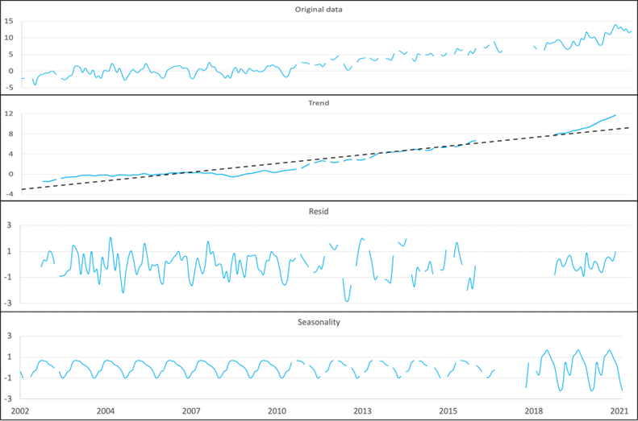
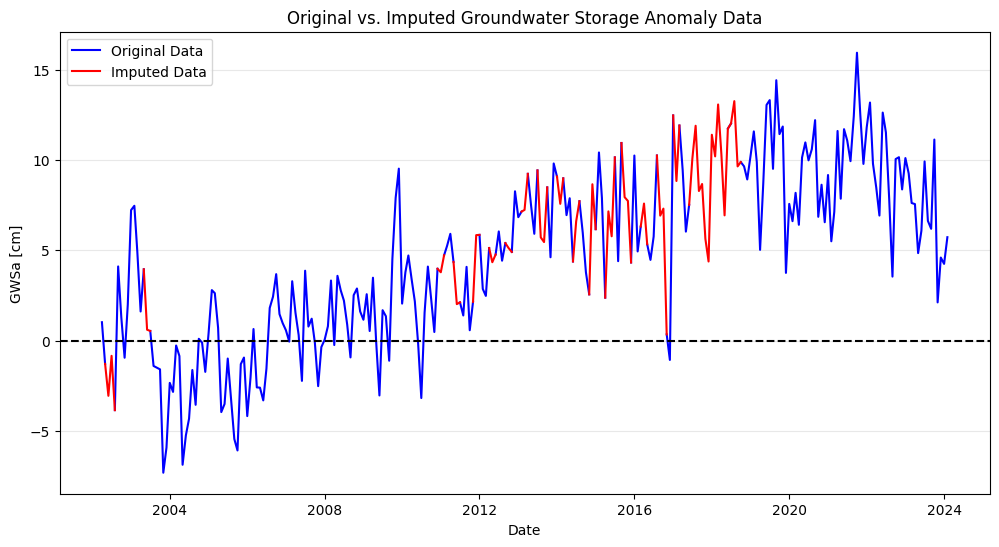
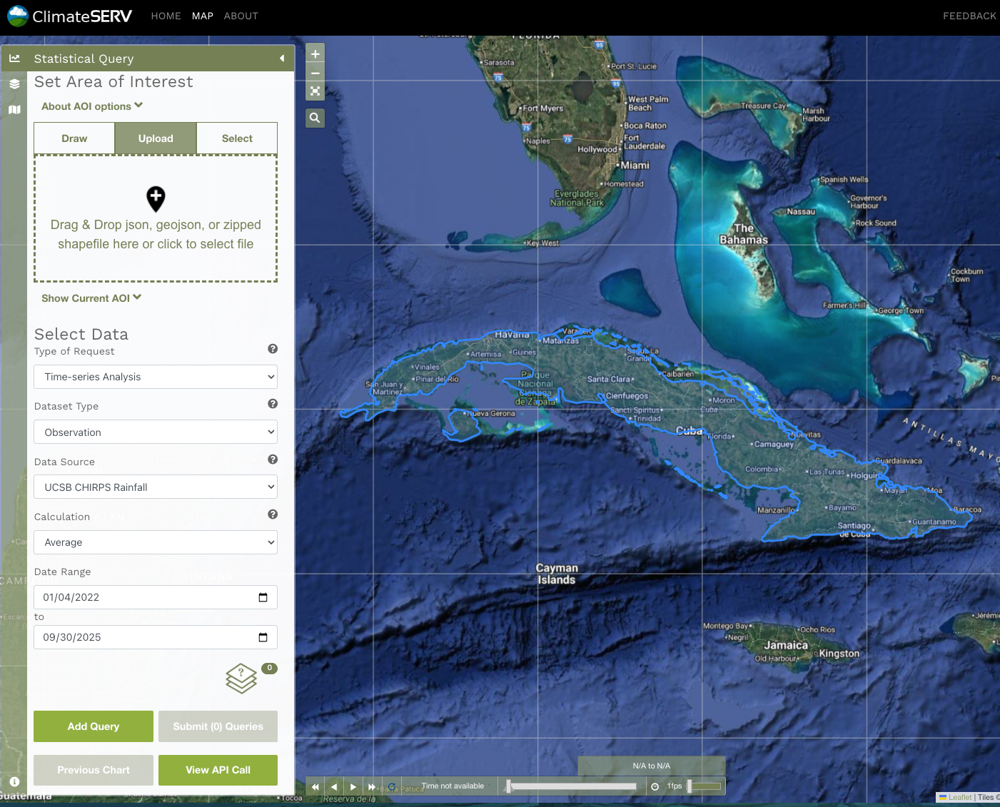
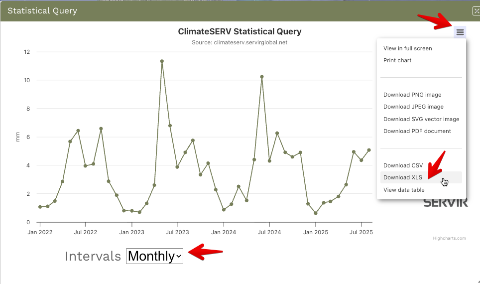
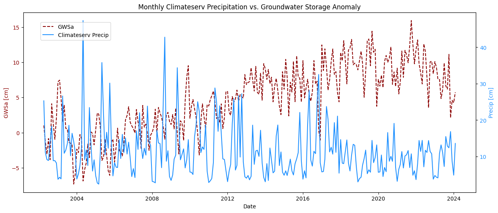
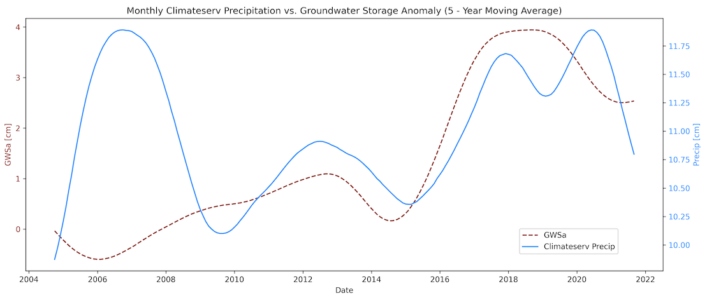

# GGST Data Processing Utilities

Below we document a set of utilities designed to assist with data processing tasks related to the GRACE Groundwater Subsetting Tool (GGST). These utilities are a set of Google Collaboratory notebooks that can be used to manipulate, analyze, and visualize GGST data. This does not include the GGSI API, which is documented separately.

## Process Raw Data from the GGST App

While the GGST application provides plots of the GRACE datasets (TWSa, GWSa, and Soil Moisture), users may wish to download the raw data for their own analysis and plotting. For example, the GRACE data has gaps in the time series corresponding to periods when the GRACE satellites were not operational. These gaps are not shown in the plots provided by the GGST app, but they are present in the raw data files. The first notebook in the utilities collection is designed to process raw data downloaded from the GGST application and generate a series of plots that can include a proper representation of the gaps in the data.

The notebook can be found here: 

Before using the notebook, you should select the storage component you wish to analyze and then download it from the 
GGST application by clicking on the three horizontal lines in the upper right corner of the plot and selecting 
"Download CSV". This will download a CSV file containing the raw data for the selected storage component.

Then in the notebook, you can upload the downloaded CSV file and run the cells to generate plots of the data. The 
notebook will first import the CSV file to a Pandas DataFrame, then it will generate plots of the data with or without 
uncertainty bounds. 

It will then generate plots that include the gaps in the data.

Finally, it will export a new CSV file that includes the gaps in the data for use in the next notebook.

## Imputing Gaps in GRACE Data

As shown above, the GRACE data has gaps in the time series due to periods when the satellites were not 
operational. The largest gap is a 12-month period in 2017-2018 between the end of the original GRACE mission in 2017 and when the
subsequent GRACE-FO satellites were launched and became operational in 2018. To resolve this issue, we have developed a utility notebook that uses a statistical method to impute synthetic data in the gaps of the GRACE data. This notebook is designed to help users generate a continuous time series of GRACE data that can be used for further analysis.

The notebook can be found here: 

One of the applications of GRACE data is estimating recharge rates from GRACE GWSa data using the Water Table 
Flucuation Method (WTF method). This method relies on identifying seasonal trends in the GWSa data to estimate
recharge rates. However, the presence of gaps in the data can make it difficult to identify these seasonal trends, 
especially when the gaps are large.
 
One way to resolve this problem is to
use a statistical algorithm to detect seasonal patterns in the data and
impute synthetic data in the gaps. This can be accomplished using a
simple seasonal decomposition model
(statsmodels.tsa.seasonal.seasonal_decompose) implemented in the
statsmodels Python package to impute the missing data. This model first
removes the trend using a convolution filter (the trend component), then
computes the average value for each period (the seasonal component), in
our case months, with the residual component being the difference
between the monthly average (seasonal component) and the actual monthly
measurements. With this approach, we decompose the GWSa time series into
three components: the trend, the seasonal, and the random components:

>$Y [t] = T [t] + S [t] + e [t]$

Where Y[t] is the GWSa, T[t] is the GWSa trend, S[t] is the
seasonal GWSa component, and e[t] is the residual GWSa component. The
decomposition components for the data shown above are as illustrated
here:

To impute the missing data, we use the trend from the data
decomposition, then add the average of the monthly and residual values
for that month to estimate the missing value. This model can be written
as:

>$Y[t] = y (T[t]) + \overline{S [t] + e[t]}$

The following figure shows the original time series in black, with
imputed values in red:

To assist users in applying the statsmodel method described above to
impute gaps in the GRACE data, we have implemented Python code to
perform the imputation in the Google Colab notebook linked above. Before running the code, you will need to prepare 
and upload a CSV file with the original data with the gaps. This file will need to contain
only two columns, which you can copy and paste from the full CSV and then save as a separate CSV file ("base_file.
csv" for example).

This file can be automatically generated using the first notebook
("Process Raw Data from the GGST App") described above. The last code block in that notebook exports a CSV file with only
the date and GWSa columns, which can be used directly in this notebook.

The following file is an example of a file prepared in the manner described
above: [west-gwsa-raw-clean.csv](wtf_files/west-gwsa-raw-clean.csv)

This file can be uploaded to the notebook, which will then read the data,
perform the imputation, and export a CSV file that includes both the original and the imputed data.

## Plot Gap-Filled GRACE Data

The next utility notebook in the collection is designed to plot the gap-filled GRACE data generated using the imputation method described above. This notebook reads the CSV file containing both the original and imputed data, then generates plots that show both datasets for comparison.

The notebook can be found here: 

While the gap-filled data can be plotted directly using the previous notebook, this notebook provides a 
stand-alone solution for plotting the original vs imputed data. It reads the CSV file generated by the imputation 
code, parses it into a Pandas DataFrame, and generates plots that show both the original and imputed data. 

Furthermore, the CSV file generated by the imputation codes has the original and imputed data in a single column, 
where the imputed data has a greater number of digits. This notebook separates the two datasets into separate 
columns for easier analysis and plotting. At the end of the notebook, the user has the option to export the 
dataframe to a CSV file where the original and imputed data are split into two columns. This can be used by 
the next notebook.

## Overlay ClimateSERV Precipitation Data with GRACE Data

Changes in groundwater storage are often influenced by precipitation patterns. To help users analyze the 
relationship between GRACE GWSa data and precipitation, we have developed a utility notebook that overlays 
ClimateSERV precipitation data with GRACE data. ClimateSERV is a web-based platform that provides access to climate 
data for user-specified regions, including precipitation data derived from satellite observations. This notebook reads 
both the GRACE GWSa data and the ClimateSERV precipitation data, then generates plots that show both datasets for 
comparison.

The notebook can be found here: 

Before using the notebook, you will need to download the ClimateSERV precipitation data for your area of interest. 
This can be done by visiting the [ClimateSERV website](https://climateserv.servirglobal.net/map), selecting the 
desired location and time period, and downloading the data as a CSV file. The following image shows the ClimateSERV interface for downloading precipitation data:

{width="1000"}

You first need to upload a geojson or shapefile that defines your area of interest. Then select the other parameters 
as shown in the image above and enter a date range of interest. The time span is limited to 20 years, so you may need to
download the data in multiple segments if you want a longer time series. Once the options are set, click on the "Add 
Query" button and then on the "Submit (1) Queries" button to download the data. This will generate a plot of 
daily precipitation for the region averaged over the specified time interval. Then select the "Monthly" option in 
the Interval dropdown, click on the three horizontal lines in the upper right corner of the plot, and click on the 
"Download XLS" button to download the monthly data as an Excel file.

The next step is to launch the notebook linked above and upload both the ClimateSERV Excel file and the GGST GWSa CSV 
file. The GGST GWSa CSV file should be the one generated by the plot_gap_filled_data notebook, which contains both the original and imputed data in separate columns. The notebook will then read both files, parse them into Pandas DataFrames, and generate plots that show both datasets for comparison.

In processing the ClimateSERV data, the notebook converts the monthly-averaged daily precipitation values in [mm/day]
to total monthly precipitation in [cm/month] by multiplying the daily values by the number of days in each month. 
This allows for a more accurate comparison with the GWSa data, which is typically reported on a monthly basis.

The notebook also includes code to compute moving averages for both the precipitation and GWSa data. This can help 
to smooth out short-term fluctuations in the data and highlight longer-term trends. The user can specify the window 
size for the moving average, which determines how many years of data are included in each average.

Each plot is automatically exported as a high-resolution PNG file that can be downloaded directly from the notebook.