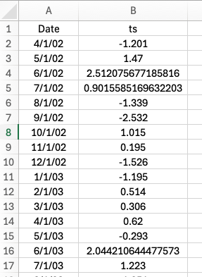
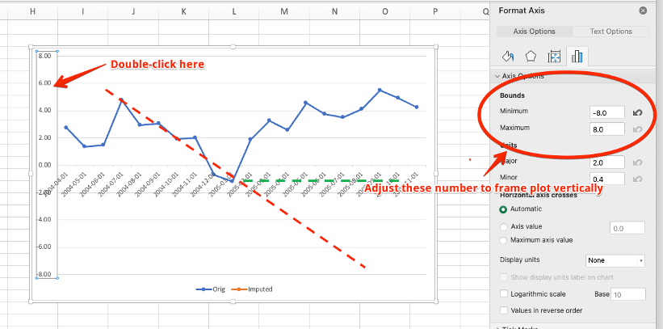
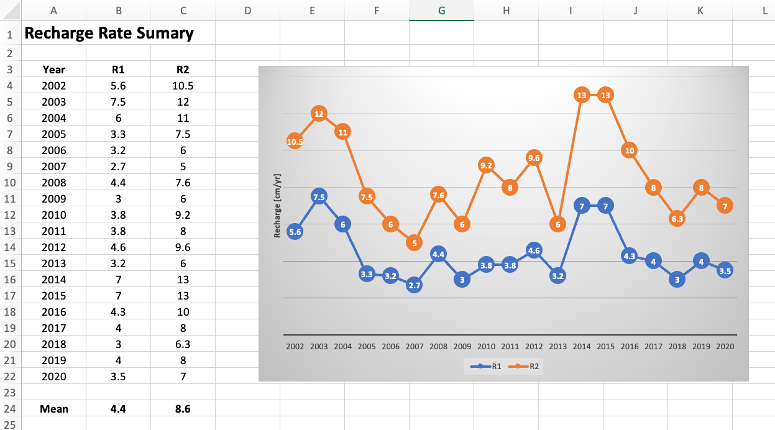

{{ include_file('docs/translate.html') }}

# **The Water Table Fluctuation Method**

In addition to obtaining the GRACE-derived groundwater storage anomaly,
it is possible to analyze the storage anomaly time series to extract an
estimate of annual recharge using a technique called the Water Table
Fluctuation (WTF) method. The WTF method was originally developed to
estimate recharge from seasonal fluctuations in groundwater levels
measured directly in monitoring wells. When a water level time series
exhibits seasonal fluctuations as shown below, it is assumed that the
declining period during the dry part of the year results from pumping
and groundwater discharge, and the rise during the wet part of the year
is the result of recharge.

Using water levels derived from a monitoring well, we can estimate the
recharge as follows:

$$R = S_y \frac{\Delta h}{t}$$

where Δh is the rebound in water level, t is the time period (typically
one year) and Sy is the specific yield or appropriate storage
coefficient.

The storage coefficient is necessary because the water level rise in the
surrounding aquifer occurs in the fractional void space and the storage
coefficient converts it to the appropriate liquid water equivalent
component in the [length]/[time] infiltration rate units used by
recharge. If we perform this analysis using the groundwater storage
anomaly curve derived from GRACE, we do not need to use a storage
coefficient as the anomaly is already in liquid water equivalent form
and we can directly estimate the recharge as:

$$R = \frac{\Delta GWSa}{\Delta t}$$

where ΔGWSa = the rise in groundwater extracted from the GRACE-derived
groundwater storage anomaly curve.

## **Methods for Estimating Recharge Component**

There are two general approaches for determining the height of the rise
associated with recharge:

With the more conservative method, the rise is measured from the trough
to the next peak as follows:

$$R_{method_1} = \frac{\Delta GWSa}{\Delta t} = \frac{S_p-S_B}{\Delta t } = R_S$$

Another method is to assume that the groundwater decline as a result of
pumping and discharge continues at the same rate in the wet season and
therefore the rise should be computed from a linear extrapolation of the
declining line as follows:

$$R_{method_2} = \frac{\Delta GWSa}{\Delta t} = \frac{S_p-S_L}{\Delta t } = R_S + R_D$$

The recharge rates extracted from these two equations could be
considered a low and a high estimate, although in our experience method
1 seems to be the most accurate. An example of applying the WTF method
to estimate recharge in Southern Niger can be found : [Evaluating
Groundwater Storage Change and Recharge Using GRACE Data: A Case Study
of Aquifers in Niger, West
Africa](https://www.mdpi.com/2072-4292/14/7/1532){:target="blank"}.

## Preparing the Water Level Time Series 

To apply the WTF method to estimate recharge on GRACE data, one must
first download the groundwater storage anomaly time series from the GGST
app and then impute the gaps using the Python utilities described on the [Data Processing Utilities](utilities.md) 
page. The last code block in the imputation notebook generates a CSV file
with the imputed time series. The CSV file contains two columns, the date and the GWSa data with both the original 
and imputed values in a single column. The imputed values have more digits than the original values.

## **Data Processing Examples**

Once the gaps have been filled, the last step is to plot and analyze the
curves one season at a time, extract the GWSa values from the curve, and
calculate the recharge estimate using either method 1 and/or method 2.

The following Excel file illustrates how to examine and process each
season of data from a GRACE-derived and imputed groundwater storage
anomaly time series: [west-gwsa-wtf.xlsx](wtf_files/west-gwsa-wtf.xlsx)

After opening the file, copy-paste the GWSa values from the CSV file generated by the
imputation algorithm as shown here. Note that the imputed values have
more digits than the original values. The formulas in columns C & D
separate the imputed data in column B to allow a multi-colored plot
where the original imputed sections can be clearly visualized.

At this point you can browse through each of the tabs for the years
starting in 2002. On each page, the seasonal values are automatically
pulled from the main sheet using a VLOOKUP formula. For each page,
manually adjust the red and green lines to fit the descending branch and
the base. Then manually scale off the SP, SB, and SL values in cm from
the vertical axis and enter into the three cells indicated in the
diagram. The RS, RD, R1, and R2 values will then be automatically
calculated.

As you examine the plot for each year, you may need to adjust the range
of the vertical axis before you can properly fit the lines. To do this,
double-click on the vertical axis, click on the axis options tab, and
manually adjust the minimum and maximum bounds to properly frame the
plot.

If you need to add additional years, copy one of the yearly sheets,
rename it, and change the year at the top of the sheet. After processing
all of the years and calculating all of the R1, R2 values, you can see a
summary in the Summary sheet.

